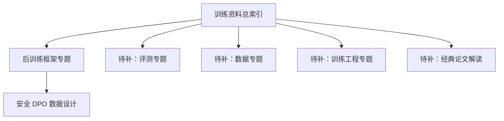

# 当前 AI / 模型训练笔记总览：从资料地图到后训练方法

## 一句话摘要

当前这套 AI / 模型训练内容，已经形成了一条相对清晰的知识主线：**训练入口 → 后训练框架 → 数据设计方法 → 博客公开输出**。
如果把它当成一个持续扩展的知识库来看，现在已经有主干，但还需要继续补全评测、训练工程和论文深读层。

## 背景

- 最近这轮整理的重点，不是简单堆资料，而是先搭一个能持续扩展的 AI / 模型训练知识结构。
- 当前已经沉淀出训练主入口、后训练框架判断、DPO 数据设计三个关键模块。
- 同时，这些内容已经开始转成博客文章，形成对外可读版本。
- 这篇文章的作用，是把当前已有内容、彼此关系、公开输出状态和后续补全方向统一讲清楚。

## 结论先行

!!! note "结论"
    当前 AI / 模型训练内容已经有了一个可用的最小知识骨架：

    1. **训练资料总索引**：告诉你先学什么、按什么顺序看。
    2. **后训练框架专题**：告诉你 SFT / DPO / GRPO 工具链应该怎么分工。
    3. **安全 DPO 数据设计专题**：把后训练进一步落到具体数据方法。

    目前最需要补的，不是更多零散链接，而是把这套内容补成一棵更完整的专题树：

    - 后训练总索引
    - 评测专题
    - 数据专题
    - 训练工程专题
    - 经典论文解读系列

## 正文

### 当前已经形成的内容结构

目前模型训练相关内容，已经可以分成三层：

| 层级 | 内容 | 当前作用 |
| --- | --- | --- |
| 第一层 | 训练资料索引 | 给出课程、论文、工程、中文项目的阅读主线 |
| 第二层 | 后训练框架专题 | 解决后训练工具链怎么选、怎么分工 |
| 第三层 | 安全 DPO 数据设计 | 进入具体的数据集设计与方法层 |

### 一张图看清当前结构

### 第一层：训练资料总索引已经解决了什么

训练资料索引的作用，是把“看什么”变成“按什么顺序看”。

它当前已经把主线压缩成一个比较合理的顺序：

1. 先学课程，建立全局图。
2. 再读经典论文，建立理论骨架。
3. 然后进入工程框架，理解训练与微调怎么落地。
4. 最后补中文开源项目，进入更贴近中文场景的实践语境。

这类文章最重要的价值，不是资料量，而是顺序感。

### 第二层：后训练框架专题回答了什么

后训练框架专题，当前主要解决的是“做开源 LLM 后训练，到底该怎么选工具链”。

目前已经明确的判断是：

- **LLaMA-Factory** 更适合作为标准后训练主工作台
- **EasyR1** 更适合接 RL / GRPO / R1-style 阶段
- **TRL** 更适合作为研究备用层，而不是默认工程主线

这说明当前内容已经不只是资料收集，而是开始提供结构化判断。

### 第三层：安全 DPO 数据设计已经落到方法层

安全 DPO 数据设计，是当前体系里最接近“可直接照着做”的一篇。

它已经明确回答了几个关键问题：

- `chosen / rejected` 应该怎么定义
- 数据至少要分哪些桶
- 为什么只做危险拒绝会训出过拒模型
- 字段 schema 应该怎么设计
- 第一版样本应该怎么批量起步

也就是说，这部分内容已经从“看资料”进入到“能落地做数据”。

### 当前博客已经公开了什么

目前博客里已经公开的训练相关文章有三篇：

- **安全 DPO 数据集设计**
- **LLM 训练资料索引：课程、论文、工程与中文项目入口**
- **当前模型训练笔记地图：主线、后训练与博客落点**

这意味着，当前已经形成了两层输出：

- **内部笔记层**：更适合持续演化与专题扩展
- **博客公开层**：更适合沉淀成外部可读文章

### 当前最明显缺的是什么

如果按“训练知识库”来看，目前缺口很清晰：

| 缺口 | 为什么重要 |
| --- | --- |
| 后训练总索引 | 现在有专题，但还缺统一导航 |
| 评测专题 | 没有评测闭环，训练体系是不完整的 |
| 数据专题 | 训练质量高度依赖数据而不只是模型 |
| 训练工程专题 | 分布式、显存、checkpoint、吞吐都还没系统整理 |
| 经典论文解读 | 当前还偏“列清单”，还缺“讲透”这一层 |

### 建议的补全顺序

按最小收益最大化来看，接下来最值得补的顺序是：

1. **后训练专题索引**  
   先把 SFT / RLHF / DPO / 蒸馏 收口成一个总导航。

2. **评测专题索引**  
   把 lm-eval、OpenCompass、benchmark、回归策略补上。

3. **训练工程专题**  
   把 Megatron、DeepSpeed、torchtune、vLLM 这些工程层系统梳理出来。

4. **经典论文解读系列**  
   从 Transformer、Scaling Laws、Chinchilla、InstructGPT、DPO 开始逐篇做结构化解读。

### 对比或补充说明

=== "当前已经有的"

    - 有训练主入口
    - 有后训练框架判断
    - 有具体 DPO 数据设计方法
    - 有博客公开层输出

=== "当前还没有的"

    - 还没有完整专题树
    - 评测与工程层覆盖还不够
    - 论文深读层还没系统展开
    - 对外文章之间的互相链接还可以继续增强

## 踩坑

- 不要把“资料索引”误当成“训练体系已经完整”。
- 不要只补后训练，不补评测和工程。
- 不要只做博客文章，不同步维护内部知识结构。
- 不要只列论文和仓库，不给出顺序与判断。

## review

- 是否完成当前内容整合：通过
- 是否清晰区分内部知识层与公开博客层：通过
- 是否移除本地路径依赖：通过
- 是否给出后续扩展方向：通过
- 写入结果：通过，允许发布

## 参考

- [安全 DPO 数据集设计](../safety-dpo-dataset-design/index.md)
- [LLM 训练资料索引：课程、论文、工程与中文项目入口](../llm-training-reading-map/index.md)
- [当前模型训练笔记地图：主线、后训练与博客落点](../current-llm-training-notes-map/index.md)
