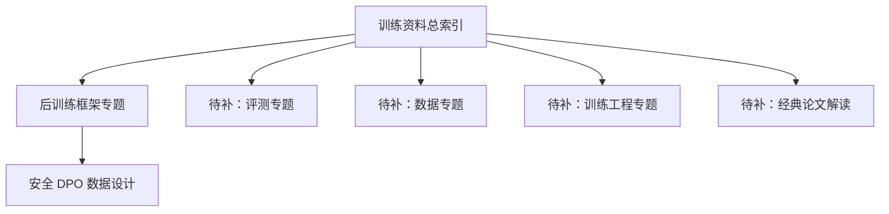

# 当前模型训练笔记地图：主线、后训练与知识落点

## 一句话摘要

当前这套模型训练内容已经形成一条清晰的知识主线：**训练入口 → 后训练框架 → 数据设计方法**。这篇文章把所有已有内容的关系、公开状态和后续补全方向一次性讲清楚。

## 背景

- 这轮整理的重点不是堆资料，而是先搭一个能持续扩展的 AI / 模型训练知识结构。
- 当前已经沉淀出训练主入口、后训练框架判断、DPO 数据设计三个关键模块。
- 这篇文章的作用，是把当前结构、彼此关系和后续补全方向统一讲清楚。

## 结论先行

!!! note "结论"
    当前 AI / 模型训练内容已经有了一个可用的最小知识骨架：

    1. **训练资料总索引**：告诉你先学什么、按什么顺序看。
    2. **后训练框架专题**：告诉你 SFT / DPO / GRPO 工具链应该怎么分工。
    3. **安全 DPO 数据设计专题**：把后训练进一步落到具体数据方法。

    目前最需要补的，不是更多零散链接，而是把这套内容补成一棵更完整的专题树。

## 当前已经形成的内容结构

| 层级 | 内容 | 当前作用 |
| --- | --- | --- |
| 第一层 | [训练资料索引](../llm-training-reading-map/index.md) | 给出课程、论文、工程、中文项目的阅读主线 |
| 第二层 | 后训练框架专题（待独立成文） | 解决后训练工具链怎么选、怎么分工 |
| 第三层 | [安全 DPO 数据设计](../safety-dpo-dataset-design/index.md) | 进入具体的数据集设计与方法层 |

### 一张图看清当前结构

## 各层详解

### 第一层：训练资料总索引

训练资料索引把"看什么"变成了"按什么顺序看"：

1. 先学课程，建立全局图。
2. 再读经典论文，建立理论骨架。
3. 然后进入工程框架，理解训练与微调怎么落地。
4. 最后补中文开源项目，进入更贴近中文场景的实践语境。

这类文章最重要的价值不是资料量，而是顺序感。

### 第二层：后训练框架专题

当前已经明确的判断是：

- **LLaMA-Factory** 更适合作为标准后训练主工作台
- **EasyR1** 更适合接 RL / GRPO / R1-style 阶段
- **TRL** 更适合作为研究备用层，而不是默认工程主线

这说明当前内容已经不只是资料收集，而是开始提供结构化判断。

### 第三层：安全 DPO 数据设计

这是当前体系里最接近"可直接照着做"的一篇，已经明确回答了：

- `chosen / rejected` 应该怎么定义
- 数据至少要分哪些桶
- 为什么只做危险拒绝会训出过拒模型
- 字段 schema 应该怎么设计
- 第一版样本应该怎么批量起步

## 当前最明显缺的是什么

| 缺口 | 为什么重要 |
| --- | --- |
| 后训练总索引 | 现在有专题，但还缺统一导航 |
| 评测专题 | 没有评测闭环，训练体系是不完整的 |
| 数据专题 | 训练质量高度依赖数据而不只是模型 |
| 训练工程专题 | 分布式、显存、checkpoint、吞吐都还没系统整理 |
| 经典论文解读 | 当前还偏"列清单"，还缺"讲透"这一层 |

## 建议的补全顺序

按最小收益最大化来看：

1. **后训练专题索引** — 把 SFT / RLHF / DPO / 蒸馏收口成一个总导航
2. **评测专题索引** — 把 lm-eval、OpenCompass、benchmark、回归策略补上
3. **训练工程专题** — 把 Megatron、DeepSpeed、torchtune、vLLM 系统梳理
4. **经典论文解读系列** — 从 Transformer、Scaling Laws、Chinchilla、InstructGPT、DPO 逐篇做结构化解读

## 踩坑

- 不要把"资料索引"误当成"训练体系已经完整"
- 不要只补后训练，不补评测和工程
- 不要只做对外文章，不同步维护内部知识结构
- 不要只列论文和仓库，不给出顺序与判断

## 参考

- [安全 DPO 数据集设计](../safety-dpo-dataset-design/index.md)
- [LLM 训练资料索引：课程、论文、工程与中文项目入口](../llm-training-reading-map/index.md)
