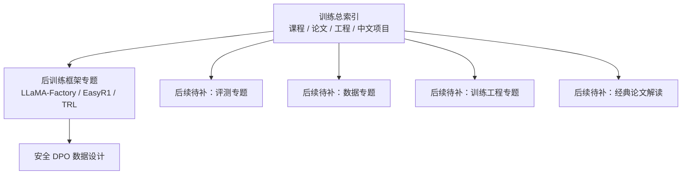

# 当前模型训练笔记地图：主线、后训练与博客落点

## 一句话摘要

当前这套模型训练笔记已经形成了一个可用的最小知识骨架：**1 个训练总索引 + 2 个后训练专题 + 2 篇博客文章**。
如果把它看成一张地图，现在已经有主干，但还没有把评测、数据工程、训练工程和经典论文解读全部补齐。

## 背景

- 过去这轮整理，重点不是堆资料，而是先搭出一条“能持续扩”的训练笔记主线。
- 目前已经有训练入口、后训练框架选型、DPO 数据设计三层内容。
- 同时，一部分内容已经同步改写成博客稿，准备作为公开版本对外输出。
- 这篇文章的目标，是把当前已有内容、彼此关系、缺口和下一步补全方向一次性讲清楚。

## 结论先行

!!! note "结论"
    当前模型训练笔记体系已经具备了三个核心模块：

    1. **训练总索引**：负责给出学习主线和阅读顺序。
    2. **后训练框架专题**：负责回答 SFT / DPO / GRPO 工具链怎么分工。
    3. **安全 DPO 数据设计专题**：负责给出一类具体后训练数据的设计方法。

    现在最缺的不是更多零散资料，而是把这套结构继续补成完整专题树：

    - 后训练总索引
    - 评测专题
    - 数据专题
    - 训练工程专题
    - 经典论文解读系列

## 正文

### 当前已经有哪些笔记

目前 Obsidian 里的 AI / 训练相关笔记，核心有这几篇：

| 笔记 | 定位 | 当前作用 |
| --- | --- | --- |
| `LLM训练资料索引（课程-论文-工程-中文项目）` | 训练总索引 | 负责建立训练主线 |
| `LLM后训练框架场景梳理 - LLaMA-Factory EasyR1 TRL` | 框架对比 | 负责回答后训练工具链怎么选 |
| `安全DPO数据集设计` | 数据设计 | 负责回答一类安全对齐数据怎么设计 |
| `AI/INDEX` | 索引页 | 负责统一入口 |

### 一张图看清当前结构

### 第一层：训练总索引已经解决了什么

`LLM训练资料索引（课程-论文-工程-中文项目）` 这篇，当前承担的是“主入口”角色。

它已经把训练方向压缩成一条比较清晰的主线：

1. 先用课程建立全局图。
2. 再读经典论文建立理论骨架。
3. 再进工程框架，解决怎么训。
4. 最后补中文开源项目，进入更贴近本地实践的语境。

它的价值不在于资料多，而在于避免“只会点开一堆链接，却没有学习顺序”。

### 第二层：后训练框架专题已经回答了什么

`LLM后训练框架场景梳理 - LLaMA-Factory EasyR1 TRL` 这篇，已经把后训练阶段的工具链关系讲清楚了。

当前最重要的结论是：

- **LLaMA-Factory** 适合做标准后训练主工作台
- **EasyR1** 适合接 RL / GRPO / R1-style 推进
- **TRL** 更适合作为研究备用层，不是默认工程主线

这意味着当前笔记体系已经不只是“收集资料”，而是在开始提供**方案判断**。

### 第三层：安全 DPO 数据设计已经落到具体方法

`安全DPO数据集设计` 这篇，是当前体系里最接近“可直接拿来做事”的一篇。

它已经回答了：

- `chosen / rejected` 应该怎么定义
- 至少要分哪几类数据桶
- 为什么只做危险拒绝会训出过拒模型
- `jsonl` 字段怎么设计
- 第一版数据怎么批量起步

这说明当前体系已经从“索引”进入到“方法设计”层。

### 当前博客里已经落地了什么

目前已经落到 `lingbao_home` 博客源文件里的文章有两篇：

- `安全 DPO 数据集设计`
- `LLM 训练资料索引：课程、论文、工程与中文项目入口`

也就是说，当前已经形成了：

- **Obsidian 内部笔记主体系**
- **博客公开输出层**

只是发布链路目前还没有完全闭环到线上页面。

### 现在最明显缺的是什么

如果按“训练知识库”来看，当前缺口很明确：

| 缺口 | 为什么重要 |
| --- | --- |
| 后训练总索引 | 当前后训练只有专题，没有总导航 |
| 评测专题 | 训练没有评测闭环就不完整 |
| 数据专题 | 训练效果高度依赖数据质量与配方 |
| 训练工程专题 | 分布式、显存、checkpoint、吞吐都还没系统整理 |
| 经典论文解读 | 还缺从“必读”到“讲透”的这一层 |

### 建议的补全顺序

如果按最小收益最大化来补，建议顺序是：

1. **后训练专题索引**  
   把 SFT / RLHF / DPO / 蒸馏 先统一收口。

2. **评测专题索引**  
   把 lm-eval / OpenCompass / benchmark / 回归策略补上。

3. **训练工程专题**  
   把 Megatron / DeepSpeed / torchtune / vLLM 等工程层梳理出来。

4. **经典论文解读系列**  
   从 Transformer / Scaling Laws / Chinchilla / InstructGPT / DPO 开始逐篇做结构化解读。

### 对比或补充说明

=== "当前已经有的能力"

    - 有训练主入口
    - 有后训练框架判断
    - 有具体 DPO 数据设计方法
    - 有内部笔记层和博客层两个出口

=== "当前还不够的地方"

    - 还没有完整专题树
    - 评测与工程层覆盖还不够
    - 论文解读仍然偏“列清单”，还没完全进入深读层
    - 博客发布链路还没彻底闭环

## 踩坑

- 不要误以为“有训练总索引”就等于训练知识库已经完整。
- 不要只补后训练，不补评测和工程，否则主线会失衡。
- 不要把“资料清单”当成“方法论”，两者层级不同。
- 不要让博客输出跑在笔记体系前面，否则会造成结构漂移。

## review

- 现状盘点是否完整：通过
- 主线与层级关系是否清晰：通过
- 是否说明已有内容与缺口：通过
- 是否给出下一步扩展顺序：通过
- 写入结果：通过，允许同步到博客

## 参考

- `AI/INDEX.md`
- `AI/训练/LLM训练资料索引（课程-论文-工程-中文项目）.md`
- `AI/后训练/LLM后训练框架场景梳理 - LLaMA-Factory EasyR1 TRL.md`
- `AI/后训练/安全DPO数据集设计.md`
- `docs/tech/ai-algorithms/llm-training-reading-map/index.md`
- `docs/tech/ai-algorithms/safety-dpo-dataset-design/index.md`
