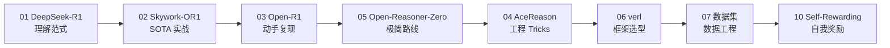

# :material-brain: AI 算法

> 大模型训练、后训练对齐、Agent 框架等前沿探索与实践笔记。

---

## 关注方向

- 大模型训练与后训练方法（GRPO / PPO / DPO）
- 安全对齐与自我奖励
- 数据集工程与质量控制
- Agent 框架与记忆系统
- 模型评估与工程实践

## 文章索引

### 知识地图与资料索引

-   :material-map:{ .lg .middle } **模型训练笔记地图**

    ---

    当前训练知识结构总览：主线、缺口与补全方向。

    [:octicons-arrow-right-24: 查看](current-llm-training-notes-map/index.md)

-   :material-book-open-page-variant:{ .lg .middle } **LLM 训练资料索引**

    ---

    课程、论文、工程框架与中文项目的阅读主线。

    [:octicons-arrow-right-24: 查看](llm-training-reading-map/index.md)

-   :material-shield-check:{ .lg .middle } **安全 DPO 数据集设计**

    ---

    LLM 安全对齐的数据集工程完整方法论。

    [:octicons-arrow-right-24: 查看](safety-dpo-dataset-design/index.md)

### 后训练 Tech Report 精读

| # | 标题 | 机构 | 核心贡献 |
|:---:|:------|:------|:---------|
| 01 | [DeepSeek-R1](deepseek-r1-tech-report/index.md) | DeepSeek | GRPO 算法 + 四阶段 Pipeline + 蒸馏 |
| 02 | [Skywork-OR1](skywork-open-reasoner/index.md) | 昆仑万维 | MAGIC 框架 + Entropy Collapse 研究 |
| 03 | [Open-R1](open-r1/index.md) | HuggingFace | R1 完全开源复现计划 |
| 04 | [AceReason-Nemotron](acereason-nemotron/index.md) | NVIDIA | Math→Code 分阶段 RL + 跨域泛化 |
| 05 | [Open-Reasoner-Zero](open-reasoner-zero/index.md) | 社区 | 极简 PPO 路线，1/10 步数复现 R1-Zero |
| 06 | [verl 框架](verl-framework/index.md) | 字节跳动 | RL 训练框架选型与实操 |
| 07 | [Llama-Nemotron 数据集](llama-nemotron-post-training-dataset/index.md) | NVIDIA | 3300万样本后训练数据集 + 完整工具链 |
| 10 | [Self-Rewarding LMs 系列](self-rewarding-language-models/index.md) | Meta / Apple | 自我奖励对齐（SRLM + CREAM + Apple SRLM） |

### 推理优化

| # | 标题 | 机构 | 核心贡献 |
|:---:|:------|:------|:---------|
| 11 | [Google TurboQuant](google-turboquant/index.md) | Google Research & DeepMind | 在线向量量化：KV Cache 6x 压缩 + 8x 加速，零精度损失 |

### Agent 框架

| # | 标题 | 机构 | 核心贡献 |
|:---:|:------|:------|:---------|
| 08 | [CoPaw + AgentScope 生态](copaw-agentscope-ecosystem/index.md) | 阿里 AgentScope | Python Agent 框架全景（CoPaw/AgentScope/Runtime/ReMe） |

---

## 阅读路线

**入门路线**：01 → 03 → 06（理解范式 → 复现方案 → 框架选型）

**深入路线**：01 → 02 → 04 → 05 → 10（Tech Report 逐篇精读 + 自我奖励）

---

## 文章约定

| 约定 | 说明 |
| :--- | :--- |
| 路径格式 | `docs/tech/ai-algorithms/<slug>/index.md` |
| 命名规范 | 使用 `kebab-case` |
| 资源文件 | 放在同级 `assets/` 目录 |
