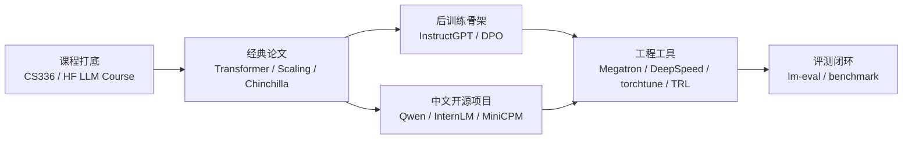

# LLM 训练资料索引：课程、论文、工程与中文项目入口

## 一句话摘要

这篇文章把 LLM 训练方向最值得先看的资料压缩成一条主线：**课程打底 → 经典论文 → 工程框架 → 中文开源项目**。
适合想系统入门训练的人，也适合已经会跑脚本、但还缺整体地图的人快速补全认知框架。

## 背景

- LLM 训练资料很多，但常见问题不是“找不到资料”，而是“没有主线”。
- 只看零散教程，容易会用工具但不会判断配方。
- 只看论文，不进工程，又很难形成可复现闭环。
- 这篇文章的目标是先给出一张训练学习地图，后续再拆到 SFT、RLHF、DPO、数据、评测等专题。

## 结论先行

!!! note "结论"
    如果你是第一次系统学习 LLM 训练，最推荐的顺序是：

    1. 先用 **CS336 + Hugging Face LLM Course** 建立全局图。
    2. 再读 **Transformer / Scaling Laws / GPT-3 / Chinchilla / InstructGPT / DPO** 六类核心论文。
    3. 然后进入 **Megatron-LM / DeepSpeed / torchtune / TRL / lm-eval**，解决“怎么训、怎么测、怎么回归”。
    4. 最后把 **Qwen / InternLM / MiniCPM** 当作中文开源实践入口，用来补足本地化与中文场景视角。

## 正文

### 一张图看清学习路径

### 第一层：课程打底

先学课程的原因很简单：课程负责建立地图，避免一开始就扎进细节。

- **Stanford CS336**  
  适合系统理解从数据、tokenization、Transformer 到训练、评测的完整流程。  
  <https://cs336.stanford.edu/spring2024/>

- **Hugging Face LLM Course**  
  更偏工程上手，适合建立 Transformers、Datasets、fine-tuning 的实操直觉。  
  <https://huggingface.co/learn/llm-course>

- **Hugging Face 中文课程入口**  
  适合中文读者和团队统一打底。  
  <https://huggingface.co/course/zh-CN/chapter1/1>

- **动手学深度学习 D2L**  
  适合补 Transformer、优化器、训练基础。  
  <https://zh.d2l.ai/>

### 第二层：经典论文骨架

训练理解真正的骨架，还是来自论文。

| 论文 | 它解决什么问题 | 为什么值得读 |
| --- | --- | --- |
| [Attention Is All You Need](https://arxiv.org/abs/1706.03762) | Transformer 架构起点 | 不读这篇，后面很多训练设计串不起来 |
| [Scaling Laws for Neural Language Models](https://arxiv.org/abs/2001.08361) | 参数、数据、算力关系 | 训练预算判断基础 |
| [Language Models are Few-Shot Learners](https://arxiv.org/abs/2005.14165) | 大模型能力与规模关系 | 理解为什么“大”会带来能力跃迁 |
| [Training Compute-Optimal Large Language Models](https://arxiv.org/abs/2203.15556) | 计算最优训练配方 | 决定 token 与参数配比思路 |
| [InstructGPT](https://arxiv.org/abs/2203.02155) | 指令对齐与 RLHF | 后训练经典起点 |
| [DPO](https://arxiv.org/abs/2305.18290) | 简化 preference optimization | 现代后训练必读 |

### 第三层：工程与评测工具

理解完原理，下一步就该进入工程闭环。

| 工具 / 项目 | 适合用途 | 位置判断 |
| --- | --- | --- |
| [Megatron-LM](https://github.com/NVIDIA/Megatron-LM) | 大规模预训练 / 并行训练 | 预训练工程核心入口 |
| [DeepSpeed Tutorials](https://www.deepspeed.ai/tutorials/) | ZeRO / 分布式 / 性能优化 | 训练性能优化核心工具链 |
| [torchtune](https://github.com/meta-pytorch/torchtune) | PyTorch 原生 post-training | 快速进入现代微调流程 |
| [TRL](https://github.com/huggingface/trl) | SFT / DPO / PPO / GRPO | 对齐实验与 trainer 研究入口 |
| [lm-evaluation-harness](https://github.com/EleutherAI/lm-evaluation-harness) | 训练后评测 | 没有评测就不算闭环 |

### 第四层：中文 / 国内开源项目入口

如果你更关注中文场景和本地化落地，可以重点跟这几条线：

- **Qwen**  
  中文开源模型生态最值得长期跟踪的入口之一。  
  <https://github.com/QwenLM/Qwen>

- **InternLM**  
  更适合观察“训练 + 评测 + 工程化”全链路。  
  <https://github.com/InternLM/InternLM>

- **MiniCPM**  
  适合关注“小模型如何训得更强”。  
  <https://github.com/OpenBMB/MiniCPM>

### 最小可执行学习闭环

如果你不想只看资料，而是想真正形成训练直觉，建议按下面这个最小闭环推进：

1. 先把 **CS336 / HF Course** 过一遍，建立全局图。
2. 读 **Transformer / Scaling Laws / Chinchilla**，建立配方与预算直觉。
3. 跟一个 **torchtune 或 TRL** 的 SFT 示例跑起来。
4. 再复现一次 **DPO**。
5. 最后用 **lm-evaluation-harness** 做一次训练前后对比。

### 对比或补充说明

=== "推荐做法"

    先建立地图，再进入 recipe。

    - 第一步先学课程，不直接扎源码。
    - 第二步读核心论文，补训练判断力。
    - 第三步再进工程框架，做一次完整复现。
    - 第四步加评测闭环，避免“感觉模型变好了”。

=== "备选做法"

    如果你已经具备较强训练背景，也可以直接从工程项目或论文切入。

    - 偏工程的人：先读 Megatron / DeepSpeed / torchtune。
    - 偏算法的人：先读 Scaling Laws / Chinchilla / DPO。
    - 但无论从哪条线进，最后都建议回到完整地图，避免长期停留在单点理解。

## 踩坑

- 不要一开始只看框架 README，不看课程和论文。
- 不要只看模型结构，不看数据、预算和评测。
- 不要只跟中文项目，不回到原始论文与官方工程。
- 不要训练完只凭主观感觉判断效果，评测闭环一定要加上。

## review

- 来源完整：通过
- 关键结论完整：通过
- 训练关联清楚：通过
- 可执行路径明确：通过
- 写入结果：通过，允许同步到博客

## 参考

- <https://cs336.stanford.edu/spring2024/>
- <https://huggingface.co/learn/llm-course>
- <https://huggingface.co/course/zh-CN/chapter1/1>
- <https://zh.d2l.ai/>
- <https://arxiv.org/abs/1706.03762>
- <https://arxiv.org/abs/2001.08361>
- <https://arxiv.org/abs/2005.14165>
- <https://arxiv.org/abs/2203.15556>
- <https://arxiv.org/abs/2203.02155>
- <https://arxiv.org/abs/2305.18290>
- <https://github.com/NVIDIA/Megatron-LM>
- <https://www.deepspeed.ai/tutorials/>
- <https://github.com/meta-pytorch/torchtune>
- <https://github.com/huggingface/trl>
- <https://github.com/EleutherAI/lm-evaluation-harness>
- <https://github.com/QwenLM/Qwen>
- <https://github.com/InternLM/InternLM>
- <https://github.com/OpenBMB/MiniCPM>
