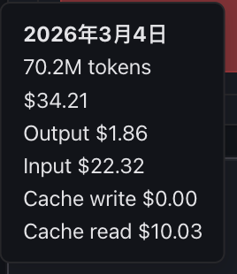

# OpenClaw 架构深度解析：自托管 AI Agent 操作系统

> **来源**：[Paolo Perazzo - OpenClaw Architecture, Explained](https://ppaolo.substack.com/p/openclaw-system-architecture-overview)（2026-02-12）+ 实际运行经验总结
>
> **定位**：面向开发者，深入理解 OpenClaw 的 Agent Loop、Skills、Tools、记忆、插件、Sub-Agents 等核心机制

---

## 一、OpenClaw 是什么

**一句话**：OpenClaw 是运行在你自己硬件上的 AI Agent 操作系统。LLM 提供智能，OpenClaw 提供执行环境。

它不是 API 套壳的聊天机器人，而是一个完整的基础设施：会话管理、记忆系统、工具沙箱、消息路由、安全隔离——全部运行在你的笔记本、VPS 或 Mac Mini 上。

---

## 二、高层架构

```
用户界面层                     核心层                      能力层
┌─────────────┐          ┌──────────────┐          ┌─────────────┐
│  WhatsApp   │          │              │          │   工具执行   │
│  Telegram   │◄────────►│   Gateway    │◄────────►│  (exec/浏览器│
│  Discord    │  Channel  │  (WS 控制面) │  Agent    │   /文件系统) │
│  iMessage   │  Adapters │              │  Runtime  │             │
│  Slack/CLI  │          │              │          │  记忆+会话   │
│  飞书/Web   │          └──────────────┘          └─────────────┘
└─────────────┘
```

**Gateway** 是单一控制面板（`src/gateway/server.ts`，Node.js 22+，WebSocket）。所有 Channel Adapter 接入它，它调度给 Agent Runtime 执行。绑定 `127.0.0.1:18789`，远程访问走 SSH 隧道或 Tailscale。

**Channel Adapters** 每平台一个，实现统一接口：认证（QR/Token/OAuth）→ 入站解析 → 访问控制（允许名单、DM 配对、@mention 要求）→ 出站格式化。支持 20+ 平台，可通过插件扩展。

### 安全架构：六层纵深防御

Gateway 作为唯一入口，承载了整个安全体系：

| 层 | 机制 | 要点 |
|----|------|------|
| **1. 网络** | 仅 `127.0.0.1` | 远程需 SSH 隧道 / Tailscale |
| **2. 认证** | Token + 设备配对 | 新设备需挑战-响应 + 人工审批 |
| **3. 渠道访问** | 允许名单 + DM 配对 | 未知发送者须审批；群组可要求 @mention |
| **4. 工具沙箱** | Docker 隔离 | main=完全访问；DM/group=容器隔离 |
| **5. 工具策略** | 分层策略链 | Profile → Provider → Global → Agent → Group → Sandbox |
| **6. Prompt 注入防御** | 上下文隔离 | 用户消息/系统指令/工具结果严格分离 |

**核心原则**：信任链逐层收紧。main session 有完全权限，DM 默认沙箱化，group 更严格。即使 prompt 被注入，爆炸半径被容器限制。

---

## 三、Skills 系统 ⭐

Skills 是 OpenClaw 的能力扩展单元——可复用的指令包，告诉 Agent 如何完成特定类型的任务。

### 4.1 三层加载优先级

```
优先级从高到低：

① workspace skills     ~/.openclaw/workspace/skills/
   └── 用户自定义，最高优先级，可覆盖同名 skill

② managed/local skills ~/.openclaw/extensions/<plugin>/skills/
   └── 插件附带的 skills（如 feishu 插件带 feishu-doc skill）

③ bundled skills       <install_dir>/node_modules/openclaw/skills/
   └── OpenClaw 自带的内置 skills
```

**覆盖规则**：如果 workspace 中存在与 bundled 同名的 skill，workspace 版本优先。这让用户可以定制内置行为。

### 4.2 SKILL.md 格式（AgentSkills 兼容）

每个 Skill 是一个目录，核心文件是 `SKILL.md`：

```
skills/
└── my-skill/
    ├── SKILL.md          # 必须，核心指令文件
    ├── metadata.json     # 可选，元数据和门控条件
    ├── scripts/          # 可选，辅助脚本
    │   └── helper.py
    └── references/       # 可选，参考资料
        └── api-docs.md
```

**SKILL.md 示例**：

```markdown
# My Custom Skill

## When to Use
当用户要求 xxx 时使用此 skill。

## Instructions
1. 首先执行 `scripts/helper.py` 获取数据
2. 然后根据结果生成报告
3. 输出到 workspace 目录

## References
参考 references/api-docs.md 了解 API 格式。
```

**metadata.json 示例**：

```json
{
  "name": "my-skill",
  "description": "用一句话描述此 skill 的功能，用于匹配对话内容",
  "version": "1.0.0",
  "openclaw": {
    "requires": {
      "bins": ["python3", "git"],
      "env": ["OPENAI_API_KEY"],
      "config": ["channels.discord"]
    }
  }
}
```

### 4.3 门控机制（Gating）

`metadata.openclaw.requires` 定义了 Skill 的运行前提条件：

| 门控类型 | 说明 | 示例 |
|---------|------|------|
| `bins` | 系统中必须存在的可执行文件 | `["python3", "ffmpeg"]` |
| `env` | 必须设置的环境变量 | `["OPENAI_API_KEY"]` |
| `config` | openclaw.json 中必须存在的配置路径 | `["channels.discord"]` |

**不满足条件的 Skill 不会出现在 `<available_skills>` 列表中**，从根本上避免 Agent 尝试调用不可用的能力。

### 4.4 按需注入（On-Demand Injection）

**关键设计**：Skills 不是全部塞进系统 prompt。OpenClaw 的做法是：

```
Step 1: 系统 prompt 中注入所有可用 Skill 的摘要清单：

<available_skills>
  <skill>
    <name>weather</name>
    <description>Get weather forecasts...</description>
    <location>~/.openclaw/skills/weather/SKILL.md</location>
  </skill>
  <skill>
    <name>github</name>
    <description>GitHub operations via gh CLI...</description>
    <location>~/.openclaw/skills/github/SKILL.md</location>
  </skill>
  ... 每个 skill 仅 ~100 tokens
</available_skills>

Step 2: 模型根据对话内容判断需要哪个 Skill

Step 3: 模型调用 read 工具读取对应 SKILL.md

Step 4: SKILL.md 内容进入对话历史，指导后续行为
```

**为什么不直接全注入？** Token 开销计算：

```
假设有 30 个 Skills，每个 SKILL.md 平均 800 tokens：
- 全量注入：30 × 800 = 24,000 tokens（每次请求都浪费）
- 按需注入：30 × 100（摘要）+ 1 × 800（按需加载）= 3,800 tokens

节省约 84% 的 prompt token 开销
```

### 4.5 ClawHub 技能市场

ClawHub（clawhub.com）是 OpenClaw 的官方 Skill 市场，类似 npm：

```bash
# 搜索 skill
clawhub search "weather"

# 安装 skill（安装到 ~/.openclaw/workspace/skills/）
clawhub install weather

# 更新到最新版本
clawhub update weather

# 同步所有已安装 skill
clawhub sync

# 发布自己的 skill
clawhub publish ./skills/my-skill
```

### 4.6 创建自定义 Skill

```bash
# 1. 创建目录
mkdir -p ~/.openclaw/workspace/skills/my-tool

# 2. 写 SKILL.md（必须）
cat > ~/.openclaw/workspace/skills/my-tool/SKILL.md << 'EOF'
# My Tool Skill

## When to Use
当用户需要 xxx 时触发。

## Steps
1. ...
2. ...
EOF

# 3. 可选：添加 metadata.json（门控条件、版本信息）
# 4. 可选：添加 scripts/ 和 references/ 目录
# 5. 重启 gateway 或等待自动热加载
```

---

## 四、Tools 工具体系 ⭐

### 5.1 内置工具清单

| 工具 | 功能 | 典型用途 |
|------|------|---------|
| `exec` | 执行 shell 命令 | 运行脚本、安装包、Git 操作 |
| `process` | 管理后台进程 | 轮询长任务、发送输入、PTY 交互 |
| `read` / `write` / `edit` | 文件操作 | 读写代码、配置、文档 |
| `browser` | Chromium 浏览器自动化 | 网页操作、截图、数据提取 |
| `canvas` | Agent 驱动的可视化工作区 | 展示 UI、A2UI 交互 |
| `nodes` | 设备控制（手机/IoT） | 摄像头、屏幕录制、定位 |
| `message` | 跨平台消息发送 | Discord/Telegram/飞书等 |
| `web_search` | 网络搜索（Brave API） | 实时信息检索 |
| `web_fetch` | 网页内容抓取 | 读取文章、API 文档 |
| `tts` | 文本转语音 | 语音回复 |
| `subagents` | 子 Agent 管理 | 多 Agent 协作 |
| `feishu_*` | 飞书文档/表格/Wiki | 飞书生态集成 |

### 5.2 工具策略（Tool Policies）

工具可用性通过 **策略链** 控制，从粗到细：

```json5
// openclaw.json
{
  "tools": {
    // 全局允许/拒绝列表
    "allow": ["exec", "read", "write", "web_search"],
    "deny": ["browser"],

    // 预定义 profile（快捷方式）
    "profile": "coding",  // minimal | coding | messaging | full

    // 按 provider 覆盖
    "byProvider": {
      "openai/*": {
        "deny": ["exec"]  // OpenAI 模型禁用 exec
      },
      "anthropic/claude-*": {
        "profile": "full"  // Claude 全量工具
      }
    }
  }
}
```

**Profile 预设**：

| Profile | 包含工具 |
|---------|---------|
| `minimal` | read, write, edit, web_search, web_fetch |
| `coding` | minimal + exec, process |
| `messaging` | minimal + message, tts |
| `full` | 所有可用工具 |

### 5.3 Tool Groups

工具按功能分组，便于策略配置中批量引用：

```json5
{
  "tools": {
    "allow": [
      "group:runtime",     // exec, process
      "group:fs",          // read, write, edit
      "group:web",         // web_search, web_fetch
      "group:ui",          // browser, canvas
      "group:messaging",   // message, tts
      "group:sessions",    // subagents, sessions_*
      "group:memory",      // 记忆相关
      "group:nodes",       // 设备控制
      "group:automation",  // cron, webhooks
      "group:openclaw"     // gateway 管理
    ]
  }
}
```

### 5.4 循环检测（Loop Detection）

Agent 有时会陷入无效循环（重复执行相同工具调用）。OpenClaw 内置三种检测器：

| 检测器 | 触发条件 | 示例 |
|--------|---------|------|
| `genericRepeat` | 连续 N 次相同工具+相同参数 | 反复 `exec("git status")` |
| `knownPollNoProgress` | 轮询类操作无进展 | `process(poll)` 反复无新输出 |
| `pingPong` | 两个工具调用交替循环 | `read → write → read → write` |

触发后 Agent 会收到循环警告，强制跳出。

### 5.5 工具如何呈现给模型

工具通过**双通道**传递给模型：

1. **Tool Schema 通道**：每个工具的 JSON Schema（函数名、参数、描述）通过 API 的 `tools` 参数传递
2. **System Prompt 通道**：工具的使用指南、限制、最佳实践写在系统 prompt 中

```
模型看到的：

System Prompt:
  "... 你可以使用 exec 工具执行 shell 命令。
   使用 pty=true 处理需要 TTY 的交互式命令 ..."

Tools (JSON Schema):
  {
    "name": "exec",
    "description": "Execute shell commands...",
    "parameters": {
      "command": { "type": "string" },
      "pty": { "type": "boolean" },
      "timeout": { "type": "number" },
      ...
    }
  }
```

---

## 五、Agent Loop（执行循环）⭐

这是 OpenClaw 的核心引擎，实现在 `src/agents/piembeddedrunner.ts`。每条消息到达后经历完整的 4 步流程：

```
① 会话解析（Session Resolution）
      │
      ▼
② 上下文组装（Context Assembly）
      │
      ▼
③ 模型调用 + 工具执行（LLM Call + Tool Execution Loop）
      │
      ▼
④ 状态持久化（State Persistence）
```

### 3.1 会话解析（Session Resolution）

每条入站消息首先被解析为一个 **Session**。Session 不只是 ID，更是**安全边界**——不同类型携带不同权限和工具策略。

| 消息来源 | Session Key 格式 | 信任级别 | 默认权限 |
|---------|-----------------|---------|---------|
| 你自己的消息 | `agent:main` | `owner` | 完全访问所有工具 |
| 私聊 DM | `agent:main:dm:<channel>:<userId>` | `trusted` | 沙箱化，受限工具集 |
| 群聊消息 | `agent:main:group:<channel>:<groupId>` | `sandboxed` | 更严格，需 @mention |
| 子 Agent | `agent:main:subagent:<uuid>` | 继承父级 | 按深度递减 |

**解析规则细节**：

```typescript
// Session 解析的核心逻辑（简化）
function resolveSession(inbound: InboundMessage): SessionDescriptor {
  const { channel, senderId, groupId, isOwner } = inbound;

  if (isOwner) {
    return { key: 'agent:main', trust: 'owner', tools: 'full' };
  }

  if (groupId) {
    return {
      key: `agent:main:group:${channel}:${groupId}`,
      trust: 'sandboxed',
      tools: resolveGroupToolPolicy(channel, groupId),
      requireMention: config.groups?.requireMention ?? true,
    };
  }

  return {
    key: `agent:main:dm:${channel}:${senderId}`,
    trust: 'trusted',
    tools: resolveDmToolPolicy(channel, senderId),
  };
}
```

**信任级别如何影响行为**：
- `owner`：可读写工作区文件、执行任意命令、访问 MEMORY.md
- `trusted`：可执行沙箱内命令、不能读 MEMORY.md
- `sandboxed`：Docker 隔离、受限网络、工具白名单

### 3.2 上下文组装（Context Assembly）

每次调用模型前，系统从多个来源**动态组合**完整的上下文。这不是一个静态 prompt，而是根据 session 类型、对话内容、可用 Skills 实时构建的。

```
系统 Prompt 构建顺序（从上到下）：

┌─────────────────────────────────────────────────┐
│  ① Pi Agent Core 基础指令（内置，不可改）          │
├─────────────────────────────────────────────────┤
│  ② AGENTS.md —— 工作区核心指令                    │
│  ③ SOUL.md —— 人格、语气、行为准则                │
│  ④ TOOLS.md —— 用户的工具使用笔记                 │
│  ⑤ IDENTITY.md —— Agent 身份信息                  │
│  ⑥ USER.md —— 用户信息                           │
├─────────────────────────────────────────────────┤
│  ⑦ 其他工作区文件（*.md，自动注入 Project Context）│
├─────────────────────────────────────────────────┤
│  ⑧ Skills —— 按需注入（见 Skills 系统章节）        │
├─────────────────────────────────────────────────┤
│  ⑨ 语义记忆搜索结果                               │
├─────────────────────────────────────────────────┤
│  ⑩ 运行时元数据（时间、主机名、模型、channel 等）   │
├─────────────────────────────────────────────────┤
│  ⑪ 工具定义（JSON Schema，见 Tools 章节）          │
└─────────────────────────────────────────────────┘
         +
   会话历史（从磁盘 JSON 加载）
```

**关键机制**：
- 工作区的 `*.md` 文件会被作为 "Project Context" 自动注入系统 prompt，但只限浅层目录
- 记忆搜索使用混合检索（BM25 + 向量语义），仅在 main session 中搜索 MEMORY.md
- Skills 不是全量注入，而是根据 `<available_skills>` 的 `<description>` 匹配当前对话主题后按需加载
- 不同 session 类型看到不同的上下文（如 group session 看不到 MEMORY.md）

### 3.3 执行循环（LLM Call + Tool Execution）

这是最核心的循环——模型生成响应时，工具调用被实时拦截和执行：

```
                    ┌──────────────┐
                    │  发送到 LLM   │
                    │ （流式请求）   │
                    └──────┬───────┘
                           │
                    ┌──────▼───────┐
              ┌─────│  解析响应流    │
              │     └──────┬───────┘
              │            │
              │     ┌──────▼───────┐     ┌──────────────┐
              │  是  │  检测到工具   │ 否  │  纯文本响应    │
              │ ┌───│  调用？       │────►│  发回 channel  │
              │ │   └──────────────┘     └──────────────┘
              │ │
              │ │   ┌──────────────┐
              │ └──►│  执行工具     │
              │     │  (exec/browser│
              │     │  /read/write) │
              │     └──────┬───────┘
              │            │
              │     ┌──────▼───────┐
              │     │  工具结果     │
              │     │  流回模型     │
              └─────┤  继续生成     │
                    └──────────────┘
                    （循环直到没有更多工具调用）
```

**流式拦截机制**：模型响应以 SSE（Server-Sent Events）流式到达。当检测到 `tool_use` block 时，运行时暂停流、执行工具、将结果作为 `tool_result` 追加到对话历史，然后发起新一轮模型调用。这个循环持续直到模型产生纯文本响应。

**工具执行的安全检查**：

```typescript
// 每次工具调用前的检查链（简化）
async function executeToolCall(call: ToolCall, session: Session) {
  // 1. 工具是否在 allow list 中
  if (!isToolAllowed(call.name, session.toolPolicy)) {
    return { error: `Tool ${call.name} is not allowed in this session` };
  }

  // 2. 循环检测
  if (loopDetector.check(call, session.recentCalls)) {
    return { error: 'Loop detected, breaking execution' };
  }

  // 3. 沙箱检查（DM/group session 可能需要 Docker）
  const executor = session.sandbox
    ? sandboxedExecutor(call, session.sandbox)
    : directExecutor(call);

  // 4. 执行并记录
  const result = await executor.run();
  session.recentCalls.push({ call, result, timestamp: Date.now() });
  return result;
}
```

### 3.4 队列化与并发控制

OpenClaw 使用 **per-session lane + global lane** 的双层队列，确保：

1. **Per-session 串行**：同一 session 的消息严格按序执行，避免状态竞争
2. **Cross-session 并行**：不同 session 的请求可以并发处理
3. **Global 限流**：全局最大并发数防止资源耗尽

```
入站消息队列：

Session A: [msg1] → [msg2] → [msg3]    ──→ 串行执行
Session B: [msg1] → [msg2]              ──→ 串行执行
Session C: [msg1]                       ──→ 串行执行
                                            ↑
                                        三个 session 之间并行
                                        但受 global concurrency 限制
```

配置示例：

```json5
// openclaw.json
{
  "agents": {
    "concurrency": {
      "maxConcurrentSessions": 3,    // 最多同时处理 3 个 session
      "queueTimeout": 120000         // 排队超时 2 分钟
    }
  }
}
```

### 3.5 自动压缩（Compaction）与预压缩记忆刷新

当会话历史超过模型的上下文窗口时，OpenClaw 自动触发 **compaction**：

```
压缩前：
[sys_prompt] [msg1] [msg2] ... [msg50] [msg51] ... [msg100]
              ─────── 旧消息 ────────   ──── 新消息 ────

压缩过程：
1. 【记忆刷新】把即将被压缩的旧消息中的关键信息
   提取并写入 memory/YYYY-MM-DD.md（预压缩 memory flush）
2. 【摘要生成】用模型对旧消息生成结构化摘要
3. 【替换】用摘要替换原始旧消息

压缩后：
[sys_prompt] [summary_of_msg1-50] [msg51] ... [msg100]
              ── 一条摘要消息 ──   ──── 新消息保留 ────
```

**预压缩记忆刷新（Memory Flush）** 是关键设计——在压缩丢弃旧消息之前，先把重要信息持久化到记忆文件，避免信息丢失。这保证了即使对话很长，关键上下文也不会被"遗忘"。

### 3.6 状态持久化

每轮执行完成后，完整的会话状态（包括所有工具调用和结果）被持久化到磁盘：

```
~/.openclaw/sessions/
├── agent_main/
│   ├── history.json          # 完整对话历史（追加式事件日志）
│   └── state.json            # session 元数据
├── agent_main_dm_discord_xxx/
│   ├── history.json
│   └── state.json
└── ...
```

---

## 六、记忆系统 ⭐

### 6.1 工作区记忆文件

```
~/.openclaw/workspace/
├── MEMORY.md                    # 长期记忆（仅 main session 可见）
└── memory/
    ├── 2026-03-25.md            # 昨天的日志
    ├── 2026-03-26.md            # 今天的日志
    └── heartbeat-state.json     # 心跳检查状态
```

- **MEMORY.md**：Agent 的"长期记忆"，手动或自动维护的精炼信息。**安全限制**：仅在 main session 中加载，group/dm session 看不到，防止泄露私人上下文
- **memory/YYYY-MM-DD.md**：每日原始笔记，记录当天发生的事件和决策
- Agent 可以在心跳（heartbeat）时定期整理日志 → 提炼到 MEMORY.md

### 6.2 向量记忆搜索

底层存储在 `~/.openclaw/memory/<agentId>.sqlite`（SQLite + 向量嵌入），支持**混合检索**：

```
查询："上次处理飞书文档的经验"
          │
          ├──→ BM25 关键词匹配（精确命中 "飞书文档"）
          │         权重: 0.3
          │
          └──→ 向量语义匹配（语义相近的 "Lark doc"/"云文档" 也能召回）
                    权重: 0.7
          │
          ▼
    合并 + MMR 多样性重排
          │
          ▼
    时间衰减加权（近期记忆权重更高）
          │
          ▼
    Top-K 结果注入上下文
```

**MMR（Maximal Marginal Relevance）多样性重排**：避免返回语义高度重复的结果。在相关性和多样性之间取平衡。

**时间衰减**：最近的记忆得分更高，避免远古记忆淹没当前相关信息。

### 6.3 预压缩记忆刷新（Memory Flush）

见 Agent Loop 章节的 compaction 部分。核心思想：**在压缩（丢弃旧消息）之前，先把关键信息写入记忆文件**，确保重要上下文不随 compaction 丢失。

### 6.4 QMD 后端（实验性）

QMD（Query-based Memory with Documents）是实验性的高级记忆后端，支持更复杂的检索策略和文档级别的记忆管理。

### 6.5 Embedding 选择

OpenClaw 按可用性自动选择 Embedding 模型，优先级：

```
local（本地模型）> openai > gemini > voyage > mistral > ollama
```

配置示例：

```json5
{
  "memory": {
    "embedding": {
      "provider": "openai",          // 强制指定
      "model": "text-embedding-3-small"
    }
  }
}
```

文件监控：工作区 `.md` 文件修改后 **1.5 秒自动重建索引**，保证搜索时效性。

---

## 七、插件（Plugins）和 MCP ⭐

### 7.1 四类插件

| 类型 | 说明 | 例子 |
|------|------|------|
| **Channel** | 新消息平台接入 | Teams、Matrix、飞书 |
| **Memory** | 替代记忆存储后端 | 向量数据库、知识图谱 |
| **Tool** | 自定义 Agent 工具 | 自定义 API 调用、硬件控制 |
| **Provider** | 自定义 LLM 提供商 | 自托管模型、私有 API |

### 7.2 插件能力注册

一个插件可以同时注册多种能力：

```typescript
// 插件入口示例
export default class MyPlugin implements OpenClawPlugin {
  register(host: PluginHost) {
    // 注册 Agent 工具（模型可调用）
    host.registerTool('my_tool', {
      description: 'Do something useful',
      parameters: { /* JSON Schema */ },
      handler: async (params) => { /* ... */ }
    });

    // 注册 RPC 方法（Gateway 可调用）
    host.registerRPC('my_rpc', async (req) => { /* ... */ });

    // 注册 HTTP handler
    host.registerHTTP('GET', '/my-endpoint', async (req, res) => { /* ... */ });

    // 注册 CLI 命令
    host.registerCLI('my-command', async (args) => { /* ... */ });

    // 注册后台服务（随 Gateway 启动）
    host.registerService('my-bg-task', async () => { /* ... */ });

    // 注册 Skills
    host.registerSkills(__dirname + '/skills');

    // 注册自动回复命令（如 /help 触发特定回复）
    host.registerAutoReply('/my-cmd', async (msg) => { /* ... */ });
  }
}
```

### 7.3 Plugin Hooks（生命周期钩子）

插件可以挂载到 Agent 执行的各个阶段：

| Hook | 触发时机 | 典型用途 |
|------|---------|---------|
| `before_model_resolve` | 模型选择之前 | 动态路由到不同模型 |
| `before_prompt_build` | 系统 prompt 组装之前 | 注入自定义上下文 |
| `before_tool_call` | 工具执行之前 | 审计日志、参数改写 |
| `after_tool_call` | 工具执行之后 | 结果后处理、监控 |
| `before_response` | 响应发回用户之前 | 内容过滤、格式调整 |
| `on_session_start` | 新 session 创建时 | 初始化自定义状态 |
| `on_compaction` | 会话压缩时 | 自定义摘要逻辑 |

### 7.4 Plugin Slots（独占类别）

某些插件类别是**独占**的——同一时间只能有一个插件占据该 slot：

- **Memory Slot**：只能有一个记忆后端（默认 SQLite，可被向量数据库插件替换）
- **这避免了多个记忆插件同时写入导致冲突**

### 7.5 MCP（Model Context Protocol）

OpenClaw 也支持 MCP 协议，可以作为 MCP server 对外暴露能力，或作为 MCP client 调用外部 MCP 工具。

---

## 八、Sub-Agents（多 Agent 协作）⭐

### 8.1 sessions_spawn 生成子 Agent

主 Agent 可以通过 `subagents` 工具生成子 Agent 来委派工作：

```
主 Agent（收到复杂任务）
    │
    ├─ spawn subagent A: "重写文档"
    │     ├─ 独立 session
    │     ├─ 独立上下文
    │     └─ 完成后自动汇报结果
    │
    └─ spawn subagent B: "搜索相关资料"
          ├─ 独立 session
          └─ 并行执行
```

### 8.2 一次性（run）vs 持久线程绑定（session + thread）

| 模式 | 说明 | 适用场景 |
|------|------|---------|
| **run** | 一次性执行，完成后 session 归档 | 文件处理、数据分析、Git 操作 |
| **session + thread** | 绑定到特定 channel 线程，持续响应 | Discord thread、长期协作 |

### 8.3 嵌套 Sub-Agent（Orchestrator Pattern）

Sub-Agent 可以再生成 Sub-Agent，形成层级结构：

```
主 Agent (depth 0)
  └─ 子 Agent A (depth 1)
       └─ 孙 Agent A1 (depth 2)   ← 受 maxSpawnDepth 限制
  └─ 子 Agent B (depth 1)
```

**maxSpawnDepth**（配置项）限制最大嵌套深度，防止无限递归。

### 8.4 工具策略按深度分配

子 Agent 的工具权限随深度递减：

```json5
{
  "agents": {
    "subagents": {
      "maxSpawnDepth": 3,
      "toolsByDepth": {
        "1": { "profile": "coding" },     // depth 1: 可执行代码
        "2": { "profile": "minimal" },     // depth 2: 仅读写
        "3": { "deny": ["exec"] }          // depth 3: 禁止执行
      }
    }
  }
}
```

### 8.5 级联停止与自动归档

- **级联停止**：当父 Agent session 结束时，所有子 Agent 自动停止
- **自动归档**：一次性 sub-agent 完成后，session 自动归档，释放资源
- **结果推送**：子 Agent 完成后，结果自动推送回父 Agent（push-based，无需轮询）

### 8.6 ACP 协议（Agent Client Protocol）

ACP 允许 OpenClaw 运行外部 Agent harness 作为子进程：

```json5
// 支持的外部 Agent
{
  "acp": {
    "harnesses": {
      "codex": { "command": "codex", "args": ["--model", "o3"] },
      "claude-code": { "command": "claude", "args": [] },
      "gemini-cli": { "command": "gemini", "args": [] }
    }
  }
}
```

工作流：主 Agent 通过 ACP 启动外部 coding agent（如 Codex、Claude Code）→ 外部 agent 在 PTY 中运行 → 通过 ACP 协议交换消息 → 结果流回主 Agent。

---

## 九、真实案例——从 Discord 消息到 Git Push

> 📌 以下案例来自我们在 Discord #笔记频道的**真实操作记录**——就是你正在阅读的这篇文章的诞生过程。

### 场景

用户在 Discord #笔记 频道发了一条消息，并附上了一个 Substack 文章链接（Paolo Perazzo 的 OpenClaw 架构解析原文）：

> "你直接按照这个文档来吧"
> "本地 markdown 然后上传到 https://github.com/tanlon2miracle-ops/my_home"

随后又陆续追加了多轮需求：
> "优化一下，左边侧边栏默认不出"
> "把成本这部分补充到 OpenClaw 的分享里面，顺便贴上我的真实消费图"
> "一些比较好的 skill 介绍"
> "安全逻辑章节，移到 Gateway 章节"
> "TOOLS 和 SKILLS 是不是放在 AGENT LOOP 之前比较好"

整个过程在**同一个 Discord session** 中完成，Agent 全程保持上下文连续性。

### 实际执行流程（第一轮：文章抓取 → 写作 → 推送）

```
Discord #笔记频道消息
      │
      ▼
┌─ ① 接收 ──────────────────────────────────────────────┐
│  discord.js 收到消息事件                                │
│  适配器解析：sender=无情的交易机器, channel=#笔记         │
│  提取：消息文本 + Substack URL                          │
└───────────────────────────────────────────────────────┘
      │
      ▼
┌─ ② 访问控制 + Session 解析 ───────────────────────────┐
│  检查 group policy → #笔记频道在允许名单中               │
│  Session → agent:main:discord:channel:xxxxx│
│  信任级别：群聊（但该频道配置了扩展工具集）               │
└───────────────────────────────────────────────────────┘
      │
      ▼
┌─ ③ 上下文组装 ────────────────────────────────────────┐
│  加载 session 历史（含之前对话上下文）                   │
│  组合系统 prompt：AGENTS.md + SOUL.md + IDENTITY.md    │
│  扫描 <available_skills> 列表，匹配当前对话：            │
│    ├─ tavily（搜索）→ 匹配关键词 "文档/调研"            │
│    ├─ crawl-for-ai（网页抓取）→ 匹配 "Substack URL"    │
│    ├─ github（Git 操作）→ 匹配 "上传到 github"         │
│    └─ 其他 20+ skills 不匹配，不加载（节省 token）       │
│  记忆搜索：查找相关的历史笔记操作经验                    │
└───────────────────────────────────────────────────────┘
      │
      ▼
┌─ ④ Skill 按需加载 ───────────────────────────────────┐
│  模型判断需要 tavily skill → read(tavily/SKILL.md)     │
│  SKILL.md 内容进入对话历史，指导后续搜索行为             │
│  （此时只加载了 1 个 skill ≈ 800 tokens，               │
│   而非全部 30 个 ≈ 24000 tokens）                      │
└───────────────────────────────────────────────────────┘
      │
      ▼
┌─ ⑤ 模型调用 + 工具执行（多轮循环）─────────────────────┐
│                                                        │
│  Turn 1: 抓取 Substack 原文                             │
│  ├─ 调用 web_fetch(substack_url) → 成功获取 HTML       │
│  └─ 提取文章完整内容（~15000 字英文原文）                │
│                                                        │
│  Turn 2: 写本地 MkDocs 结构                             │
│  ├─ exec: git clone https://github.com/xxxx/my_home│
│  ├─ 分析文章结构，用中文重写为 MkDocs 格式技术笔记       │
│  ├─ 添加 YAML frontmatter（tags, date）                 │
│  └─ write → docs/tech/tinkering/openclaw-architecture/index.md│
│                                                        │
│  Turn 3: 更新 mkdocs.yml 导航                           │
│  ├─ read(mkdocs.yml) → 理解现有导航结构                 │
│  ├─ edit → 在 nav.技术.折腾记录 下新增条目               │
│  └─ exec: git add + commit + push                      │
│                                                        │
└───────────────────────────────────────────────────────┘
      │
      ▼
┌─ ⑥ 响应交付 + 持久化 ────────────────────────────────┐
│  生成简短状态回复 → Discord 格式化 → 发回 #笔记         │
│  持久化完整会话状态（含所有工具调用和结果）               │
└───────────────────────────────────────────────────────┘
```

### 后续迭代（同一 session 内持续追加）

这是 Agent Loop 上下文连续性的最佳体现——以下每一轮操作都在**同一个 session** 中，Agent 完全记得之前的对话和文件操作：

| 轮次 | 用户指令 | Agent 执行 | 涉及工具 |
|------|---------|-----------|---------|
| **第 2 轮** | "侧边栏默认不出" | 修改 `mkdocs.yml` 移除 `navigation.expand`，新建 `sidebar-toggle.js`，重写 CSS 添加浮动按钮 + 遮罩层 | `read` → `edit` → `write` → `exec(git push)` |
| **第 3 轮** | "调研下 OpenClaw 成本" | 用 **tavily skill** 搜索中英文成本数据，抓取 Hostinger/腾讯云/Medium 等 6 篇文章，整理成结构化章节 | `exec(tavily)` → `web_fetch` ×6 → `edit` → `exec(git push)` |
| **第 4 轮** | "一些比较好的 skill 介绍" | 用 **tavily skill** 搜索 ClawHub 排行、awesome-openclaw-skills，抓取 Firecrawl/DataCamp 评测文章，撰写推荐章节 | `exec(tavily)` → `web_fetch` ×4 → `edit` → `exec(git push)` |
| **第 5 轮** | "安全逻辑移到 Gateway 章节" | 剪切安全架构表格 → 粘贴到二、高层架构下方 → 重新编号后续章节 | `read` → `edit` ×3 → `exec(git push)` |
| **第 6 轮** | "TOOLS 和 SKILLS 放 AGENT LOOP 之前" | 编写 Node.js 脚本重排章节顺序 + 修正所有子节编号 | `exec(node)` → `exec(git push)` |

### 本案例实际使用的 Skills 和工具

| 类别 | 名称 | 用途 | 调用次数 |
|------|------|------|---------|
| **Skill** | tavily | 搜索成本数据、Skills 排行、各类补充资料 | 4+ 次 |
| **Skill** | crawl-for-ai | 备选网页抓取（web_fetch 失败时降级） | 按需 |
| **内置工具** | web_fetch | 抓取 Substack 原文、Hostinger、Medium 等页面 | 10+ 次 |
| **内置工具** | read / edit / write | 读取和修改 mkdocs.yml、CSS、JS、Markdown | 20+ 次 |
| **内置工具** | exec | git clone/add/commit/push，运行 Node.js 脚本 | 15+ 次 |

> 💡 **总计**：从第一条消息到你看到的这篇完整文章，Agent 在同一 session 中执行了 **60+ 次工具调用**，涉及 6 轮用户交互、9 次 git push。整个过程无需切换工具或手动操作文件。

### 关键观察

- **真实的迭代式协作**：不是一次性生成，而是用户不断追加需求，Agent 在同一 session 内无缝衔接
- **Skill 按需加载**：25+ 可用 Skill 中只加载了 tavily 和 crawl-for-ai 两个的完整 SKILL.md
- **工具降级**：`web_fetch` 遇到反爬时，Agent 自主切换到 crawl-for-ai skill
- **跨消息上下文**：Agent 记住前几轮的仓库路径、文件结构、章节编号，不需要重复说明
- **复杂编辑能力**：不只是写新文件——还能重排章节顺序、修改 CSS/JS、调整 YAML 配置

---

## 十、成本与 Token 经济学 ⭐

OpenClaw 本身开源免费（MIT License），**但运行它的真实成本可能远超你的预期**。这是社区里讨论最多的话题之一——有人半夜睡一觉醒来收到 $1100 的 API 账单，也有人通过优化把月费从 $1000+ 压到 $20 以下。

### 10.1 成本构成

```
总成本 = API Token 费用（80-95%）+ 服务器/基础设施（5-20%）
```

- **API Token 费用**：占绝对大头。每次 Agent 执行都触发 LLM API 调用，而 OpenClaw 的 token 消耗远高于普通聊天
- **服务器费用**：VPS 约 $5-50/月，本地运行则几乎零成本（仅电费）

### 10.2 为什么 OpenClaw 这么烧 Token？

与普通聊天的「一问一答」不同，OpenClaw 的 token 消耗是**结构性**的：

| 消耗来源 | 说明 | 影响 |
|---------|------|------|
| **系统 Prompt** | 每次请求都注入 AGENTS.md、SOUL.md、工具定义等 | 单次请求基础消耗 3000-8000 tokens |
| **多轮工具调用** | 一个任务触发 5-10+ 次 LLM 调用 | 乘数效应，成本 ×5 到 ×10 |
| **上下文膨胀** | 对话历史 + 工具结果不断累积 | 活跃会话可膨胀到 20 万+ tokens |
| **Skills 注入** | 每次请求携带可用 Skill 列表 | 30 个 Skill ≈ 额外 3000 tokens |
| **心跳/定时任务** | 24/7 持续运行，定时触发 API 调用 | "全天候烧钱" |

**核心洞察**：你写的 Prompt 只占总 Token 的不到 1%。**真正的成本杀手是系统 Prompt（每次请求都重复注入）和不断膨胀的对话历史。**

### 10.3 各模型定价对比（2026 年初）

**预算模型**（适合日常简单任务）：

| 模型 | 输入价格 | 输出价格 | 单次典型成本 |
|------|---------|---------|-------------|
| GPT-4o-mini | $0.15/M | $0.60/M | ~$0.00045 |
| DeepSeek-V3 | $0.07/M | $0.14/M | ~$0.00015 |
| Llama 3.1 8B | $0.05/M | $0.08/M | ~$0.00010 |

**中端模型**（平衡性能与成本）：

| 模型 | 输入价格 | 输出价格 | 单次典型成本 |
|------|---------|---------|-------------|
| Claude Haiku 4.5 | $1.00/M | $5.00/M | ~$0.0035 |
| GPT-4o | $2.50/M | $10.00/M | ~$0.0075 |
| Claude Sonnet 4.6 | $3.00/M | $15.00/M | ~$0.010 |

**高端模型**（复杂推理，烧钱王者）：

| 模型 | 输入价格 | 输出价格 | 单次典型成本 |
|------|---------|---------|-------------|
| Claude Opus 4.5 | $5.00/M | $25.00/M | ~$0.015 |
| Claude Opus 4.6 | $5.00/M | $25.00/M | ~$0.015 |

> ⚠️ 以上为「每百万 Token」价格（$/M tokens）。20 万 token 的会话，单次请求成本高达 $6-8（Opus 级别）

### 10.4 真实用户成本场景

根据 Hostinger、腾讯云开发者社区、Reddit 等多方数据汇总：

| 使用场景 | 月均 API 费用 | 月均总成本 |
|---------|-------------|-----------|
| 轻度个人使用（<5000 次调用） | $1-6 | $6-13 |
| 小型团队（5000-10000 次调用） | $15-40 | $25-50 |
| 中度自动化（多频道 + 定时任务） | $50-100 | $50-100 |
| 重度使用（浏览器自动化 + 多 Agent） | $100-200+ | $100-200+ |

### 10.5 我的真实消费

以下是我使用 GitHub Copilot API（Claude Opus 4.6）的真实消费截图：




### 10.6 五招降本实战

#### ① 设置日预算上限（必做）

```json5
// openclaw.json
{
  "agents": {
    "defaults": {
      "budget": {
        "maxTokensPerDay": 500000,
        "maxCostPerDay": 5.00    // 每天最多花 $5
      }
    }
  }
}
```

#### ② Fallback 链——让便宜模型干简单活

```json5
{
  "agents": {
    "defaults": {
      "model": {
        "primary": "anthropic/claude-sonnet-4-6",   // 复杂任务
        "fallbacks": [
          "anthropic/claude-haiku-4-5",              // 中等任务
          "deepseek/deepseek-chat"                   // 简单任务（极便宜）
        ]
      }
    }
  }
}
```

#### ③ 减少上下文冗余

- 精简 `MEMORY.md`，只保留关键信息
- 定期用 `/compact` 压缩长会话
- 降低 `imageMaxDimensionPx`（默认 1200，截图多时可降到 800）

#### ④ 利用 Prompt Caching

Anthropic 的 cache read 比正常 input 便宜很多。配置心跳间隔略小于缓存 TTL，保持缓存"热"：

```yaml
agents:
  defaults:
    heartbeat:
      every: "55m"    # Anthropic 缓存 TTL = 1h
    models:
      "anthropic/claude-opus-4-6":
        params:
          cacheRetention: "long"
```

#### ⑤ 本地模型兜底（零 API 成本）

用 Ollama 运行本地模型处理心跳、简单查询：

```bash
ollama pull qwen3-coder:32b
```

### 10.7 成本监控命令

| 命令 | 功能 |
|------|------|
| `/status` | 查看当前 session 的 token 用量和预估成本 |
| `/usage full` | 每条回复附带 token 消耗明细 |
| `/usage cost` | 查看本地成本汇总 |
| `/context list` | 查看系统 prompt 各部分的 token 占比 |

---

## 十一、社区生态 ⭐

OpenClaw 的能力扩展全靠 Skills。截至 2026 年 2 月，ClawHub 已收录 **13,700+** 社区技能，VoltAgent 社区维护的 [awesome-openclaw-skills](https://github.com/VoltAgent/awesome-openclaw-skills) 精选列表筛选出 5,200+ 经过审核的优质技能。

> ⚠️ **安全提醒**：2026 年 2 月的安全审计在 ClawHub 上标记了 **341 个恶意 Skill**（其中 335 个分发 AMOS macOS 窃取器）。安装前务必检查作者声誉、版本历史和星标数，或使用 Skill Vetter 扫描。

### 11.1 必装 Top 10 精选

| 排名 | Skill 名称 | 下载量 | 类别 | 核心功能 |
|------|-----------|--------|------|---------|
| 1 | **Capability Evolver** | 35K | Agent 进化 | 分析历史交互，自动优化 prompt 策略和执行路径 |
| 2 | **GOG** | 33.8K | 生产力 | Google Workspace 六合一（Gmail/Calendar/Drive/Docs/Sheets/Contacts） |
| 3 | **self-improving-agent** | 32K | 记忆 | 跨 session 捕获纠正和经验教训，Agent 越用越聪明 |
| 4 | **Ontology** | 27.6K | 知识图谱 | 结构化实体关系图谱，支持复杂关联查询 |
| 5 | **Summarize** | 26.1K | 生产力 | 一键总结 URL、PDF、音频、YouTube 视频 |
| 6 | **GitHub** | 24.8K | 开发 | 管理 Issues、PRs、CI，通过 `gh` CLI 驱动 |
| 7 | **Notion** | 13.9K | 生产力 | 读写 Notion 页面、数据库、评论 |
| 8 | **Nano Banana Pro** | 13.4K | 创意 | Gemini 驱动的图片生成和编辑 |
| 9 | **Agent Browser** | 11K | 自动化 | 浏览器全自动化（表单填写、数据爬取、多标签并行） |
| 10 | **Obsidian** | 12.4K | 知识管理 | 本地 Obsidian 笔记库集成，无需云端 |

### 11.2 按场景推荐

#### 🔍 搜索与信息获取

| Skill | 特点 | 安装命令 |
|-------|------|---------|
| **Tavily** | AI Agent 专用搜索引擎，返回结构化摘要而非链接列表 | `clawhub install tavily` |
| **Firecrawl CLI** | 处理 JS 重度页面和反爬站点，返回干净 Markdown | `npx -y firecrawl-cli init --browser --all` |

#### 💬 通信与协作

| Skill | 特点 | 安装命令 |
|-------|------|---------|
| **Slack** | 搜索和发送 Slack 消息，支持三种回复模式 | `clawhub install slack` |
| **Himalaya** | IMAP/SMTP 邮件，适配 Outlook/ProtonMail 等任何提供商 | `clawhub install himalaya` |
| **Eleven Labs Agent** | 高质量语音合成 30+ 语言，支持电话回调 | `clawhub install elevenlabs-agent` |

#### 🛠️ 开发者工具

| Skill | 特点 | 安装命令 |
|-------|------|---------|
| **Mcporter** | 在 OpenClaw 内管理 MCP server（安装、配置、OAuth） | `clawhub install mcporter` |
| **API Gateway** | 100+ 第三方 API 的托管 OAuth（Stripe/Salesforce/HubSpot） | `clawhub install api-gateway` |
| **OpenAI Whisper** | 本地语音转文字，音频不离开你的机器 | `clawhub install openai-whisper` |

#### 🍎 macOS 原生（零 API Key）

由 OpenClaw 作者 @steipete 维护：

| Skill | 功能 |
|-------|------|
| Apple Mail | 邮件管理 |
| Apple Calendar | 日历事件 |
| Apple Reminders | 提醒事项 |
| Apple Notes | 备忘录 |
| Apple Shortcuts | 快捷指令（所有自定义 Shortcut 可用） |

#### 🔒 安全

| Skill | 特点 |
|-------|------|
| **Skill Vetter** (3.5K 下载) | 安装前扫描 Skill 的恶意代码（隐藏网络调用、混淆 shell 命令） |

### 11.3 工作流编排：Clawflows

Clawflows 可以将多个 Skill 串联为自动化流水线：

```yaml
# 每日研究工作流示例
workflow: daily-research
steps:
  - skill: tavily
    action: search
    query: "AI industry news today"
  - skill: summarize
    action: digest
    input: previous_step
  - skill: mission-control
    action: add_brief
    content: previous_step
```

### 11.4 安装与管理

```bash
# 搜索
clawhub search "web scraping"

# 安装
clawhub install <skill-slug>

# 查看已安装 & 可用
openclaw skills list --eligible

# 查看详情
openclaw skills info <skill-name>
```

### 11.5 生态数据一览

| 指标 | 数据 |
|------|------|
| ClawHub 总技能数 | 13,729+（2026.02） |
| awesome-openclaw-skills 精选 | 5,211 |
| 已过滤（垃圾/重复/恶意） | 7,215 |
| 分类数 | 30+ |
| 月访问量 | 1M+（社区最大第三方资源） |

> 📚 **更多资源**：
> - [awesome-openclaw-skills（GitHub 精选列表）](https://github.com/VoltAgent/awesome-openclaw-skills)
> - [ClawHub 官方市场](https://clawhub.ai)
> - [Firecrawl 的 16 Best Skills 评测](https://www.firecrawl.dev/blog/openclaw-skills)

---

## 参考链接

- [OpenClaw 官网](https://openclaw.ai/)
- [GitHub 仓库](https://github.com/openclaw/openclaw)
- [官方文档](https://docs.openclaw.ai)
- [Paolo Perazzo 原文](https://ppaolo.substack.com/p/openclaw-system-architecture-overview)
- [ClawHub 技能市场](https://clawhub.com)
- [Discord 社区](https://discord.com/invite/clawd)
