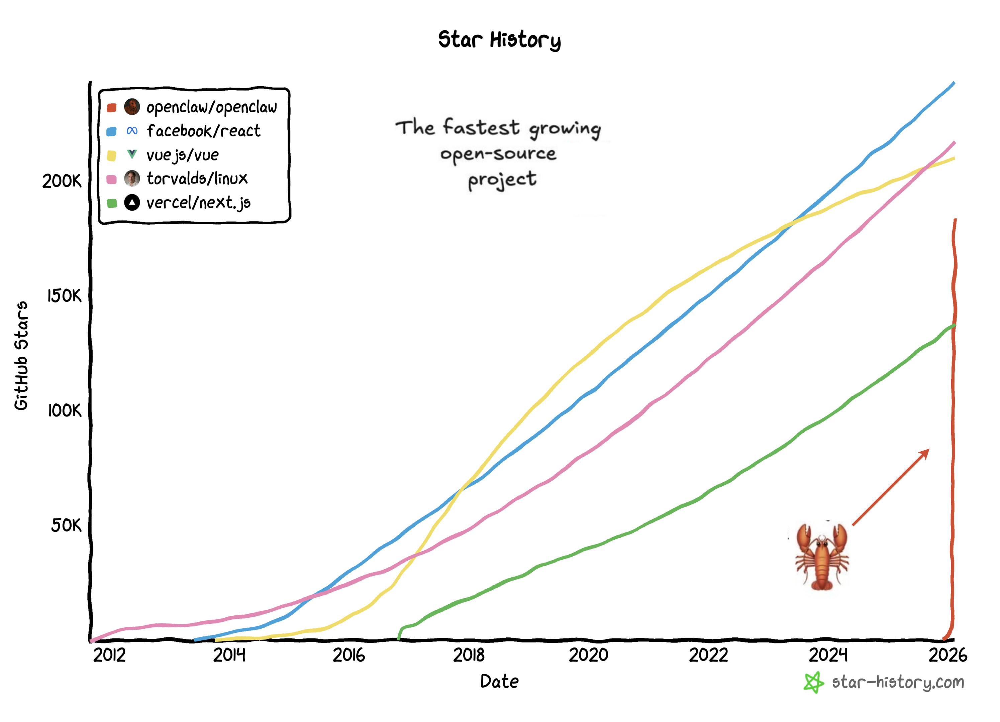
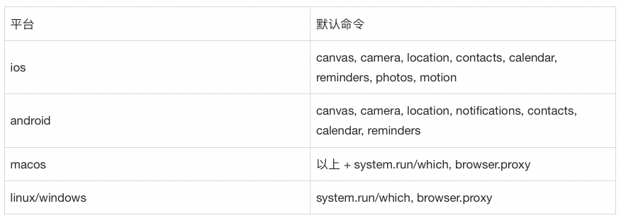
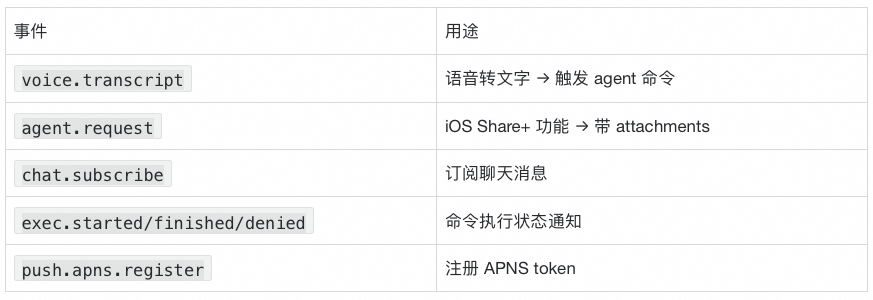

# OpenClaw 技术架构深度解析

!!! info "资料来源"
    本文整合自两篇深度技术文章，覆盖 OpenClaw 从高层架构到底层实现的完整解析。

    - **架构总览**：[ppaolo · Substack](https://ppaolo.substack.com/p/openclaw-system-architecture-overview)
    - **模块实现**：[阿里云开发者（踏天）](https://mp.weixin.qq.com/s/FUJEofqbK7vX-J64UX8Nkg)

---

## 一、OpenClaw 是什么

OpenClaw 是一个运行在 **自有基础设施** 上的个人 AI 助手平台（笔记本、VPS、Mac Mini、云容器均可）。它将 AI 模型和工具连接到你已有的消息应用——WhatsApp、Telegram、Discord、Slack、Signal、iMessage 等。

**核心理念**：OpenClaw 将 AI 助手视为 **基础设施问题**，而非 prompt 工程问题。

> LLM 提供智能；OpenClaw 提供操作系统。

Andrej Karpathy 评价：

> "the most incredible sci-fi takeoff-adjacent thing I've seen."

从 2026 年 1 月到 2 月，短短八周内 OpenClaw 从一个周末 WhatsApp 中继脚本，成长为 GitHub 历史上增长最快的开源项目之一，超过 180,000 stars。

---

## 二、高层架构：Hub-and-Spoke 模式

OpenClaw 采用 **中心辐射架构**，以单一 Gateway 为控制平面：

| 组件 | 职责 |
|------|------|
| **Gateway** | WebSocket 服务器，连接各消息平台和控制界面，将消息路由到 Agent Runtime |
| **Agent Runtime** | 端到端运行 AI 循环：组装上下文 → 调用模型 → 执行工具 → 持久化状态 |

**关键洞察**：接口层（消息来源）与助手运行时（智能和执行）分离。一个持久助手可通过任意消息应用访问。

---

## 三、插件扩展体系

OpenClaw 通过四种方式扩展，无需修改核心代码：

| 类型 | 说明 |
|------|------|
| **Channel 插件** | 新增消息平台（Teams、Matrix、Mattermost 等） |
| **Memory 插件** | 替代存储后端（向量库、知识图谱） |
| **Tool 插件** | 自定义能力（超越内置的 bash/browser/文件操作） |
| **Provider 插件** | 自定义 LLM 或本地模型 |

插件位于 `extensions/`，遵循 discovery-based 模型。

---

## 四、核心组件详解

### 4.1 Channel 适配器

每个消息平台一个专用适配器，实现统一接口：

| 职责 | 说明 |
|------|------|
| 认证 | WhatsApp QR 配对、Telegram/Discord bot token、iMessage 原生集成 |
| 入站解析 | 提取文本、媒体、反应、线程上下文，统一格式 |
| 访问控制 | 白名单、DM 配对策略、群组策略 |
| 出站格式化 | Markdown 方言、消息大小限制、媒体上传、输入指示器 |

??? example "WhatsApp 配置示例"
    `json
    {
      "channels": {
        "whatsapp": {
          "enabled": true,
          "allowFrom": ["+1234567890"],
          "groups": {
            "*": { "requireMention": true }
          }
        }
      }
    }
    `

### 4.2 控制界面

| 界面 | 技术 | 特点 |
|------|------|------|
| Web UI | Lit Web Components | 聊天/配置/会话检查/健康监控 |
| CLI | Commander.js | gateway/agent/channels/message/doctor 命令 |
| macOS 应用 | Swift | 菜单栏、Voice Wake、WebChat、远程 Gateway |
| 移动端 | iOS/Android | WebSocket 节点、摄像头/屏幕/位置/Canvas |

### 4.3 Gateway 控制平面

- 位于 `src/gateway/server.ts`，Node.js 22+，ws 库
- 默认绑定 `127.0.0.1:18789`（仅回环）

**设计原则**：

- [x] 每主机一个 Gateway（防止 WhatsApp 会话冲突）
- [x] 全协议类型化（JSON Schema from TypeBox）
- [x] 事件驱动（非轮询）
- [x] 副作用操作要求幂等键

### 4.4 Agent Runtime

每个回合四步：

`mermaid
graph LR
    A["① 会话解析"] --> B["② 上下文组装"]
    B --> C["③ 执行循环"]
    C --> D["④ 状态持久化"]
`

1. **会话解析** — 映射消息到会话（main/DM/group），各类型携带不同权限和沙箱规则
2. **上下文组装** — 加载会话历史 + 构建动态系统 prompt + 语义搜索记忆
3. **执行循环** — 监听工具调用 → 执行（可能在 Docker 沙箱中）→ 结果流回模型
4. **状态持久化** — 保存消息、工具调用/结果到磁盘

**系统 Prompt 组成**：

- 工作区文件：`AGENTS.md`（行为规则）、`SOUL.md`（人格语气）、`TOOLS.md`（工具约定）
- 会话历史 + Skills + 语义记忆搜索结果
- 工具定义（内置 + 插件）+ Pi Agent Core 基础指令

---

## 五、消息端到端流程

| 阶段 | 操作 | 延迟 |
|------|------|------|
| 1. 接收 | Baileys 收到 WebSocket 事件 → 适配器解析 | — |
| 2. 访问控制 | 白名单检查 → 配对审批 → 会话路由 | <10ms |
| 3. 上下文组装 | 加载会话 + 系统 prompt + 记忆搜索 | <100ms |
| 4. 模型调用 | 流式发送到模型 provider | 200–500ms |
| 5. 工具执行 | 拦截工具调用 → 执行 → 结果返回模型 | 可变 |
| 6. 响应投递 | 格式化 → 发送 → 持久化 | — |

---

## 六、SandBox 沙箱系统

Sandbox 是 Docker 隔离层，在容器中执行 Agent 工具操作。

### 6.1 沙箱模式

| 模式 | 行为 |
|------|------|
| `off` | 不隔离，直接在主机运行 |
| `non-main` | 仅隔离非主会话（**默认**） |
| `all` | 所有会话都隔离 |

### 6.2 容器作用域

| 作用域 | 说明 |
|--------|------|
| `session` | 每个会话一个容器（**默认**） |
| `agent` | 每个 Agent 一个容器 |
| `shared` | 所有会话共享一个容器 |

### 6.3 安全限制

**禁止挂载**：`/etc`、`/proc`、`/sys`、`/dev`、`/root`、`/boot`、`/run`、`/var/run/docker.sock`、`/`

**默认安全配置**：

- 只读根文件系统（`readOnlyRoot: true`）
- 无网络（`network: "none"`）
- 丢弃所有 capabilities（`capDrop: ["ALL"]`）

### 6.4 工具策略层级

`
全局工具策略 → Agent 策略 → Sandbox 策略（只能进一步限制） → 子 Agent 策略
`

---

## 七、记忆管理系统

### 7.1 核心理念：文件即真相

| 维度 | 实现 |
|------|------|
| 存储 | 纯 Markdown 文件（人类可读可编辑） |
| 索引 | SQLite + 向量嵌入（机器可搜索） |
| 模式 | 文件优先，索引辅助 |

### 7.2 文件布局

`
~/.openclaw/workspace/
├── MEMORY.md           # 长期记忆（精选、持久化）
└── memory/
    └── YYYY-MM-DD.md   # 每日记忆日志
`

### 7.3 混合搜索机制

`mermaid
graph TD
    A[用户查询] --> B[关键词提取 FTS]
    A --> C[向量嵌入]
    B --> D[BM25 搜索]
    C --> E[向量搜索]
    D --> F[加权融合]
    E --> F
    F --> G[时间衰减]
    G --> H[MMR 去重]
    H --> I[Top-K 结果]
`

**融合公式**：`finalScore = 0.7 × vectorScore + 0.3 × textScore`

**MMR 去重**：`score = λ × relevance - (1-λ) × max_similarity`（默认 λ=0.7）

**时间衰减**：`decayedScore = score × e^(-λ × ageInDays)`

| 时间 | 保留分数 |
|------|----------|
| 今天 | 100% |
| 7 天 | 84% |
| 30 天（半衰期） | 50% |
| 90 天 | 12.5% |

常青文件（不衰减）：`MEMORY.md`、非日期命名文件

### 7.4 Embedding 提供商

优先级：Local → OpenAI → Gemini → Voyage → Mistral → disabled

### 7.5 预压缩记忆刷新

会话接近自动压缩时，发送静默提示让模型将重要信息写入记忆文件，避免上下文压缩时丢失关键信息。

---

## 八、Skills 模块

Skill = 封装特定能力的 `SKILL.md` 文件（YAML frontmatter + 使用指南）。

### 8.1 加载优先级（从低到高）

`
extra → bundled → managed → agents-skills-personal → agents-skills-project → workspace
`

| 来源 | 路径 | 说明 |
|------|------|------|
| extra | config.skills.load.extraDirs | 用户自定义目录 |
| bundled | skills/（包内） | 内置技能 |
| managed | ~/.openclaw/skills | 全局管理技能 |
| workspace | /skills | 项目技能（**最高优先**） |

### 8.2 运行时过滤

1. `config.skills.entries[key].enabled` 检查
2. bundled allowlist 检查
3. 运行时资格：OS 兼容性 / 二进制依赖 / 环境变量 / 配置路径

!!! note "技能发现 vs 注入"
    OpenClaw 可在运行时发现技能，但**不会**将所有技能注入每个 prompt。只注入当前回合相关的技能，避免 prompt 膨胀。

---

## 九、Session 管理

### 9.1 会话键格式

`
基础格式: agent:<agentId>:<rest>
`

| 类型 | 识别模式 | 示例 |
|------|----------|------|
| direct | `:direct:` 或 `:dm:` | `agent:main:telegram:direct:user123` |
| group | `:group:` | `agent:main:discord:group:guild789` |
| channel | `:channel:` | `agent:main:slack:channel:C123` |
| cron | rest 以 `cron:` 开头 | `agent:main:cron:backup` |
| subagent | `:subagent:` | `agent:main:subagent:child` |
| thread | `:thread:` 或 `:topic:` | `agent:main:discord:group:123:thread:456` |

### 9.2 生命周期

`mermaid
graph TD
    A[解析 Agent ID] --> B[加载会话存储]
    B --> C{重置触发器?}
    C -->|"/new, /reset"| D[重置会话]
    C -->|否| E[评估新鲜度]
    E --> F[处理线程派生]
    F --> G[持久化文件]
    G --> H[归档旧会话]
    H --> I[触发插件钩子]
`

**默认过期时间**：DM 24h / Group 4h / Thread 24h

---

## 十、自进化机制

`mermaid
graph LR
    A[用户指令/反馈] --> B[Agent 修改文件]
    B --> C[下次会话加载新内容]
    C --> D[行为改变]
    D --> A
`

可修改的核心文件：

| 文件 | 用途 |
|------|------|
| `AGENTS.md` | 行为规则 |
| `SOUL.md` | 人格边界 |
| `MEMORY.md` | 长期记忆 |
| `memory/YYYY-MM-DD.md` | 短期记忆 |

---

## 十一、多代理路由

路由层次（从高到低优先级）：

1. **binding.peer** — 精确对等匹配
2. **binding.peer.parent** — 父对等匹配（线程继承）
3. **binding.guild+roles** — 公会+角色
4. **binding.guild** — 公会匹配
5. **binding.team** — 团队（Slack）
6. **binding.account** — 账户匹配
7. **binding.channel** — 频道匹配
8. **default** — 默认代理

---

## 十二、Nodes 分布式设备管理

Node = 远程可执行命令的客户端（iOS/Android/macOS/Linux/Windows）

**配对流程**：

`
Node → pair.request → Gateway（加入 pending）
→ 管理员审批 → approve（生成 token）
→ Node verify → 认证成功
`

**安全机制**：token + 节点 ID 双重验证 / 命令白名单 / Exec 审批 / 输出截断 200KB

---

## 十三、安全架构总览

### 信任模型

> 单用户信任 — 一个可信操作者 → 一个 Gateway → 多个 Agent

### 六层防御

| 层级 | 机制 |
|------|------|
| 1. 网络安全 | 默认绑定回环，远程需 SSH 隧道或 Tailscale |
| 2. 认证与配对 | Token/密码 + 设备加密挑战-响应 |
| 3. 频道访问控制 | DM 配对、白名单、群组 mention 要求 |
| 4. 工具沙箱 | Docker 隔离（main=主机，DM/Group=沙箱） |
| 5. 工具策略 | Tool Profile → Provider → Global → Agent → Group → Sandbox |
| 6. Prompt 注入防御 | 上下文隔离 + 推荐最强模型 + 硬性控制 |

---

## 十四、部署架构

| 模式 | 场景 | 特点 |
|------|------|------|
| 本地开发 | macOS/Linux | `pnpm dev`，无需认证 |
| macOS 生产 | Menu Bar App | LaunchAgent，Voice Wake，iMessage |
| Linux/VPS | 远程 Gateway | systemd + SSH 隧道 或 Tailscale |
| Fly.io | 容器部署 | Docker + 持久卷 + 托管 HTTPS |

---

## 十五、配置管理

- JSON5 格式（支持注释和尾随逗号）
- `$`{VAR} 环境变量替换
- `$`include 模块化（最大嵌套 10 层）
- 多层验证：Zod Schema + 历史检查 + 插件验证
- 200ms TTL 缓存
- 写入审计日志（检测异常如大小骤降）

---

## 十六、总结展望

### 架构趋势

1. **控制平面与执行节点解耦** — 中枢管理 + 边缘执行
2. **多智能体协作网络** — 专业化 Agent 通过标准协议协作
3. **软硬件深层权限管理** — 精细的 TCC 策略

### 应用趋势

1. **全渠道业务渗透** — 对话即办公
2. **动态可视化协同** — Canvas + 交互式决策
3. **沙箱安全生产环境** — 自动隔离不受信任输入
4. **企业级技能中心** — 私有技能注册表

---

## 参考链接

- [OpenClaw 官网](https://openclaw.ai/)
- [GitHub 仓库](https://github.com/openclaw/openclaw)
- [ppaolo 架构解析原文](https://ppaolo.substack.com/p/openclaw-system-architecture-overview)
- [阿里云开发者文章（下篇）](https://mp.weixin.qq.com/s/FUJEofqbK7vX-J64UX8Nkg)
